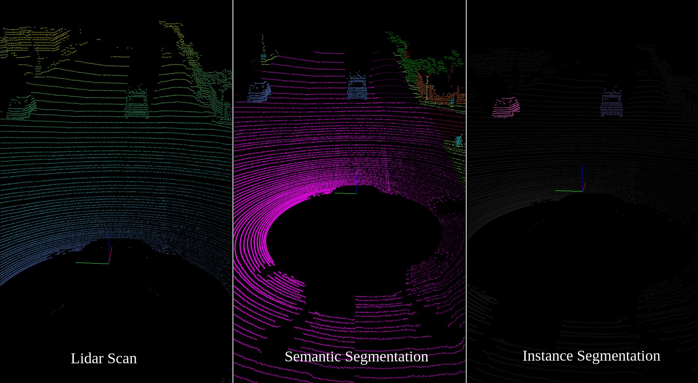
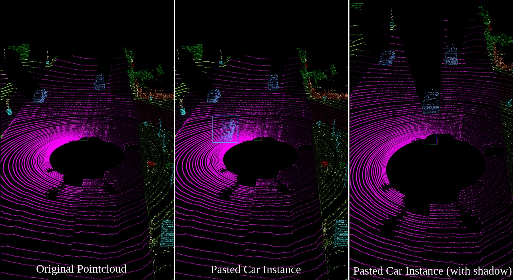

# Pointcloud-Copy-Paste-Augmenter
Library for Copy-Paste Augmentations in Pointclouds.

* Unaugmented pointcloud:


* Pointcloud augmented with a car instance:


## Requirements
* numpy
* pyyaml

## File Structure
Organise your pointclouds and labels in the following way:

```
dataset
|
└───velodyne
│   │   file1.bin
│   │   file2.bin
|   |   ...
|
└───labels
    │   label1.label
    │   label2.label
    |   ...
```

In `params.py`, set `DATA_PATH` as your path to `dataset`. Augmented pointclouds will be saved in a similar directory structure, so create a new directory with empty `velodyne` and `labels` folders and set that to `SAVE_PATH` in `params.py`.

## Usage
* Look through parameters in `params.py` and modify accordingly.
* Run `extract_cloud.py` to extract instances of a specified object class.
    * Example: To extract `moving-cars`, change `LABEL_ID` in `params.py` to `252`.
    * Find label values in `semantic-kitti.yaml` under `labels`.
* This extracts usable instances into a folder named after the instance, folder is named `moving-cars` in this case.
* Change `PLACEMENT_ID` to IDs of possible ground locations for the extracted instances. This is where the instances will be pasted.
    * Example: If you want `moving-cars` to be pasted on `road` (`40`), `parking` (`44`), `other-ground` (`49`) and `terrain` (`72`), set `PLACEMENT_ID` to `[40, 44, 49, 72]`.
* Change `OBJ_PASTE_NAME` in `params.py` to name of folder where instances were extracted and saved (`moving-cars` in this case).
* Run `paste_object.py`; augmented pointclouds are stored in `SAVE_PATH/velodyne` and augmented labels are stored in `SAVE_PATH/labels`.
* During the pasting sequence, an instance is randomly selected from the folder to paste into the pointcloud.
* Each instance is assigned the class label as well as an instance ID:
    * Example: A `moving-car` instance is augmented in and all its points are assigned the class label value of `252`.
    * All its points are also assigned an instance ID based on the number of `moving-cars` present in the pointcloud.
    * If there are `n moving-cars` in the pointcloud, then the augmented points get an instance ID of `n+1`.
* Change `NUMBER_INSTANCES` if you want to augment more instances per pointcloud.
    * Example: If you want `2` instances of `moving-cars` pasted per pointcloud, set `NUMBER_INSTANCES` to `2`.

**NOTE: Only works with SemanticKITTI. Should work with other datasets as long as they contain instance labels, but you will have to change around some code for their instance labels if they are not stored in a similar fashion to SemanticKITTI.**

## Visualization
* All pointclouds are visualized using the [semantic-kitti-api](https://github.com/PRBonn/semantic-kitti-api). Your directory structure will need to look like this for it to work:

```
dataset
└───sequences
    └───00
        └───velodyne
        │   │   file1.bin
        │   │   file2.bin
        |   |   ...
        |
        └───labels
            │   label1.label
            │   label2.label
            |   ...
```
* Install the dependencies for visualization:

```sh
sudo apt install python3-dev python3-pip python3-pyqt5.qtopengl
pip3 install --user -r requirements.txt
```

* To visualize the pointclouds, use `visualize.py`:

```sh
cd semantic-kitti-api
./visualize.py --sequence 00 --dataset /path/to/dataset/ --do_instances
```
